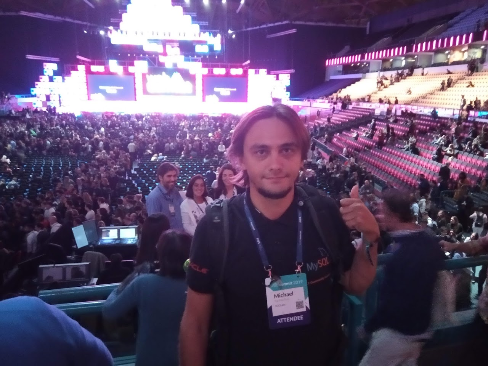
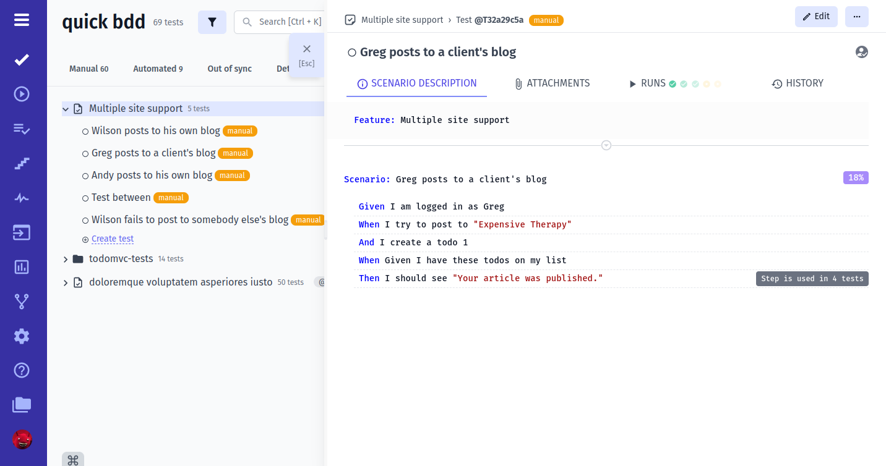
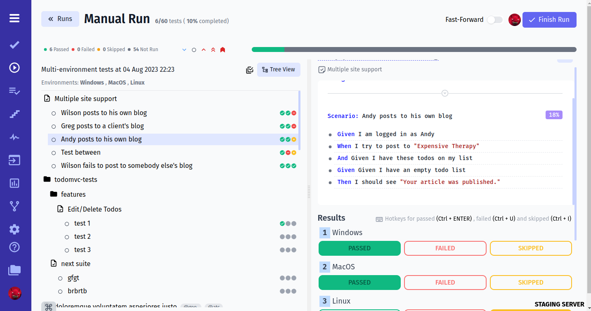
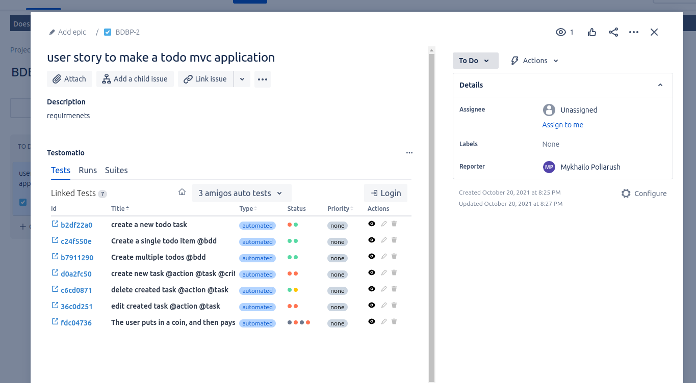
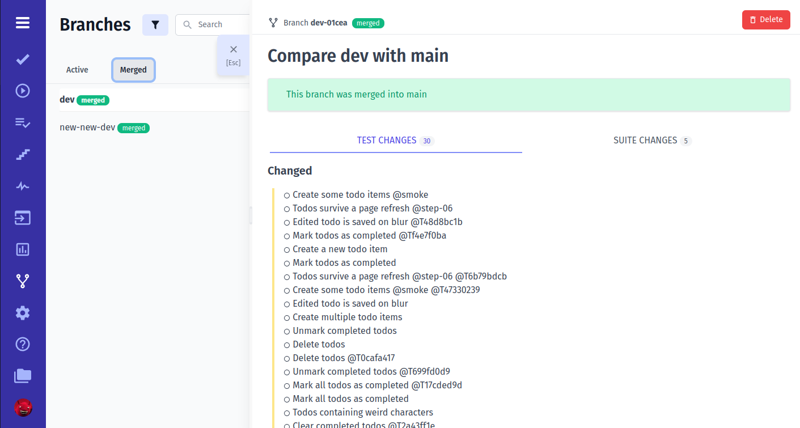
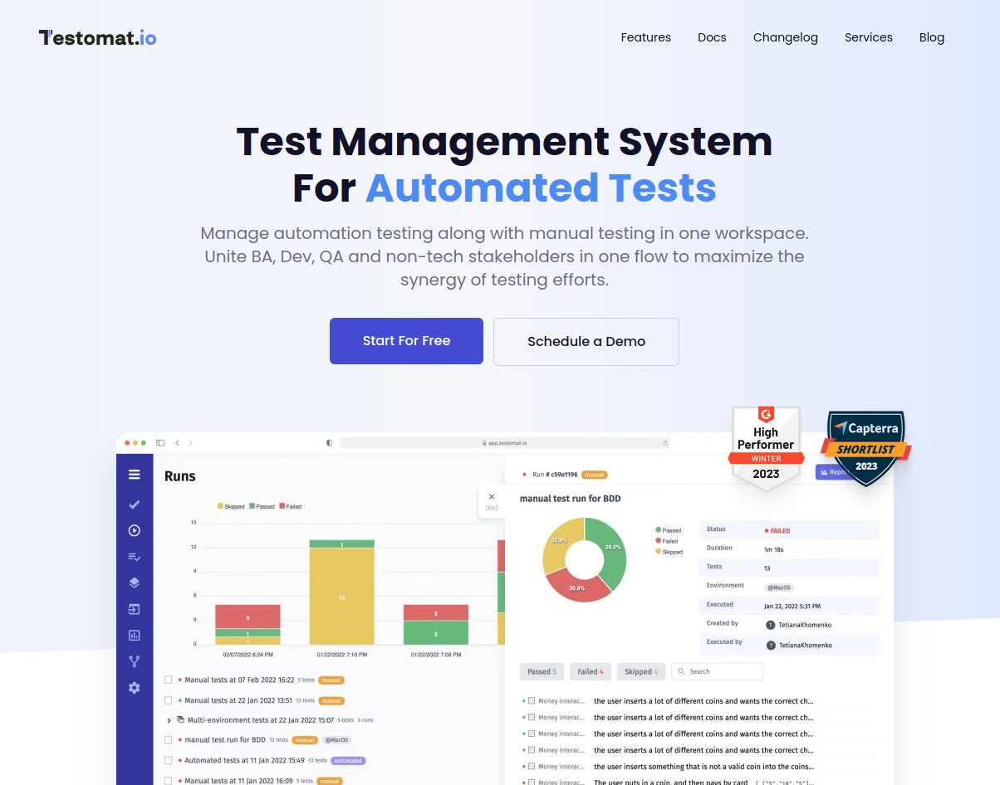

# Як зробити свою тест менеджмент систему

*...і нащо?*

 
 

> Боднарчук Михайло
Testomat.io 
2023

---

# Привіт, я Михайло, і в мене є своя тест менеджмент система!

---

## Хто якими системами користується?

* TestRail
* Zephyr
* XRay
* Allure
* Qase
* Testmo
* Google Spreadsheets
* ...

---

> Коли ми починали Testomat.io я не знав про них ні-чо-го

---

### Що таке Testomat.io?

---

## Що в нас є в 2023

* Ручні та автотести
  * Фокус на JS/TS проектах
* Інтеграція Jira, GitHub, GitLab, Jenkins, ...
* Підтримка BDD 
* Аналітика (Flaky tests, Non-executed tests, Ever-failing tests)

---

> Вцілому, достатньо щоб конкурувати з TestRail

  

*Але як ми дійшли до такого?*

---

# Це був 2019 рік...

* WebSummit в Лісабоні
* Ми з Мішею вирішили робити стартап

---

Мій ко-фаундер Міша Поляруш

--- 

# Ідея №1

* Система обліку **автотестів**
* Можливість записувати дії користувача у веб застосунку
* Планування нових тестів
* Опис тестів у Markdown форматі

  
*уже краще ніж писати в spreadsheets...*

---

# Чого ми не прагнули? 

* Конкурувати з TestRail
* Конкурувати з Allure
* Конкурувати з Reportportal
* Конкурувати з CucumberStudio
* ...і загалі у нас новий ринок!

--- 

# 🔦 Make your tests visible!

---

Була одна проблема...

---

Мій баланс: 0$

* я опенсорс розробник
  * Codeception
  * CodeceptJS
* скиньте бубласонька донати
* консультації, тренінги, бахлава медова, креветки, мідії...

---

# Я влаштувався на роботу

---

* Я створив архітектуру проекту
* Ми найняли першого співробітника
* Ми почали їбошити

---

# check-tests

> Наша основна фішка

* Синтаксичний аналізатор автотестів
* Побудований на основі AST
* Імпортував тести не запускаючи їх

--- 

# Технології

* Rails
* Mysql
* EmberJS
* Redis
* TailwindCSS

---

# Testomat.io в 2020

* два ко-фаундери
* один співробітник
* ~~дизайнер~~
* ~~тестувальник~~
* ~~маркетолог~~

---

# Таймлайн

* Розробка почалась в лютому 2020
* Перші демо: березень 2020
* 0$ залучених інвестицій

---

# Перші відгуки:

Ой, а чого у вас нема:

* ручних тестів
* репортів
* BDD
* інтеграції з джирою
* ...................................................

---

# Проміжні висновки

1. Ринок є
2. Нікому не потрібна система обліку автотестів 

---

# Осінь 2020

* Я звільнився з роботи
* Фічі ростуть як на дрожжах
* Перші потенційні клієнти

---

# Підтримка BDD

---

# Мультиенв запуск

---

# SaaS

* А як у вас з безпекою?
* А коли проходили Pen-testing
* Чи є у вас SOCK2 сертифікація?
* Чи є SSO?

---

> Як з'їсти велику рибу і не порвати рота...

---

# Зима 2020-21

Є перший великий клієнт!

---

# Треба все і зразу!

* Нотіфікейшни
* CI системи
* Інтеграція з джирою
* Аааааааа.....

---

# Інтеграція з Джирою

---

# Проміжні висновки

* Клієнти хочуть все робити в джирі
* Клієнти хочуть залучати стейк холдерів
* Стейкхолдери не покидають джиру
* Стейкхолдери хочуть бачити тести без авторизації

---

# Jira Plugin: Технології

* React (+ MobX)
* Jira Cloud + Jira Server
* Jira Storage
* Testomat.io API

---

# Що має робити Jira Plugin

> ВСЕ!

* Створення, редагування тестів (і BDD)
* Автокомпліт 
* Запуск ручних тестів
* Запуск тестів на CI
* Покриття тестів
* Epic View
* ...

---

## Ми готові підписати конракт але...

# Бранчі!

---

# Так, бранчі як у Git

---

# Бранчі...

* Користувачі можуть незалежно міняти тести
* А/B тести
* Стейкхолдери приймають (мерджать) бранчі
* Інтеграція в Jira

---

Літо 2021:

# 🎉 Ми підписали другого великого клієнта!

...і перші дивіденди

---

# 2022 рік

> війна війною, але нам треба фічі!

---

Сьогодні

# Testomat.io це 

* український стартап
* ~10 співробітників
* 0$ інвестицій

---

# Як ми працюємо

* ми платимо мало
* але у нас цікаво
* ми всі відповідальні за продукт
* орієнтуємось на фідбек клієнтів
* прагнемо зробити найкращу сучасну ТМС

---

# Roadmap

* UX для управління тестами як у Notion
* Двустороння синхронізація з Git
* Нативна підтримка Java/Python
* Exploritary testing
* AI-інтеграція
* ....

---

# 🔦 Make your tests visible!

---

# Чи варто робити свою TMS?

* Є ринок і великий запит на нові системи
* Ринок великий, але дуже консервативний
* З 2019 з'явились сильні конкуренти
* Потрібно робити багато фіч, інтеграцій
* Постійно слухати користувачів

---

Дякую за увагу! Питання?

# [Testomat.io](https://testomat.io)

* Free 2 projects, trial
* Ручні та автотести
* Репортер для JS/TS/Java/Python

Контакти:

𝕏 @davert
𝕏 @testomatio

